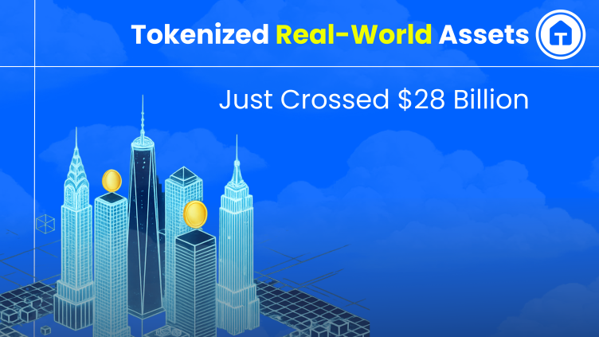

#  GoldenCity MVP

> Transforming Real Estate Through Web3, AI, and Immersive 3D Experiences

GoldenCity is a next-generation PropTech platform that combines blockchain technology, NFT-based property ownership, immersive 3D visualization, and artificial intelligence to create a seamless real estate investment and management experience.

The platform enables users to explore properties in interactive 3D environments, invest through tokenized ownership, conduct transparent blockchain transactions, and receive AI-powered recommendations tailored to their interests and investment goals.

  

## 🚀 Key Features

### 🌐 Immersive Property Exploration
- Interactive 3D property visualization powered by Three.js
- AR/VR-ready virtual property walkthroughs
- Real-time property navigation and discovery
- Responsive experience across desktop and mobile devices

### 🔗 Blockchain-Powered Ownership
- NFT-based property tokenization
- Fractional real estate ownership
- Transparent on-chain ownership records
- Secure wallet integration
- Crypto payment support (ETH, USDC, MATIC)

### 🤖 AI-Powered Intelligence
- Personalized property recommendations
- Natural language property search
- Real estate valuation insights
- Transaction anomaly and fraud detection

### 📈 Portfolio & Asset Management
- User investment dashboard
- Property portfolio tracking
- Transaction history management
- Asset performance monitoring

---

## 🎯 MVP Scope

The current MVP includes:

- Property browsing and discovery
- Interactive 3D property visualization
- Wallet connection and authentication
- NFT ownership demonstration
- AI-powered recommendations
- User portfolio management
- Administrative dashboard
- Transaction tracking

---

## 🔮 Future Roadmap

### Web3
- Cross-chain interoperability
- DAO governance
- Advanced staking mechanisms
- Secondary marketplace support

### AI
- Enhanced recommendation engine
- Investment analytics
- Predictive property valuation
- Advanced conversational assistant

### Platform
- Mobile applications
- Multi-language support
- Expanded AR/VR experiences
- Enterprise integrations

---

## 🛡️ Security

Security and transparency are foundational principles of GoldenCity.

- Smart contract auditing
- Secure wallet integrations
- OAuth2 & JWT authentication
- Role-based access control
- Transaction monitoring
- Infrastructure hardening

---

## 📋 Evaluation & Review

This repository serves as a technical demonstration environment for:

- Product demonstrations
- Architecture reviews
- Technical assessments
- Engineering evaluations
- Stakeholder presentations
- MVP validation and feedback

---

## 🌍 Vision

GoldenCity aims to democratize real estate investment by removing traditional barriers through blockchain technology, fractional ownership, and intelligent digital experiences.

By bringing together Real Estate, Web3, AI, and immersive visualization technologies, GoldenCity creates a modern ecosystem for discovering, investing in, and managing real-world assets in the digital era.

---

## © Tirios.ai 

Building the future of real estate ownership and investment through decentralization, intelligence, and immersive experiences.